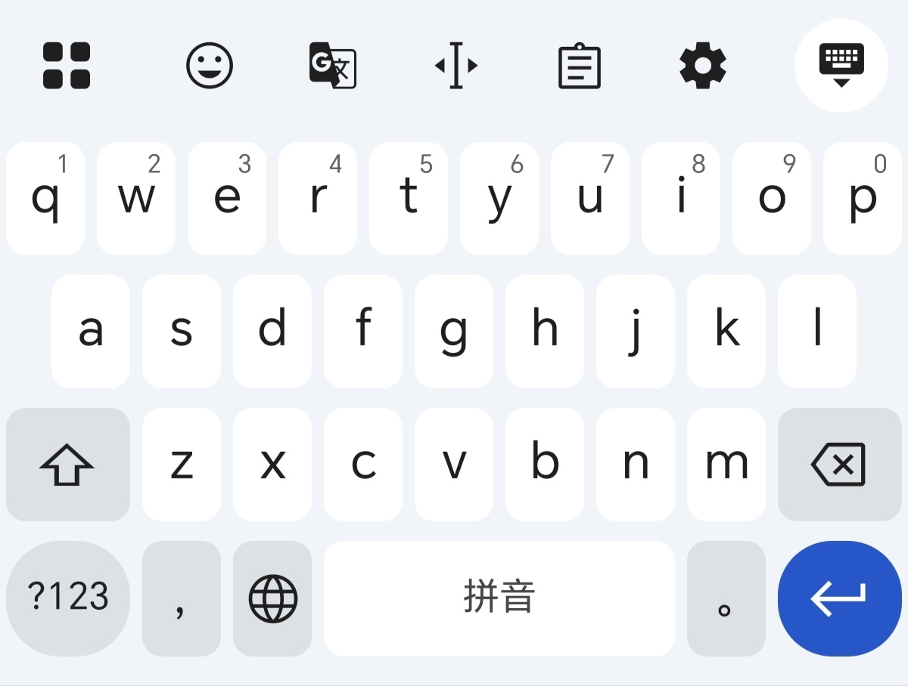

# rime-ggboard

高仿 Gboard Rime 皮肤

# 教程

下载 [GGboard皮肤](https://github.com/x-skystar/rime-ggboard/releases/tag/v1.0.0) 并解压到 Rime 个人用户文件夹里，重新部署，键盘样式选择 GGboard 即可使用。

若想自定义更多布局和功能，使用 [GGboard自定义](https://rime-ggboard.netlify.app)，更新代码即可。

# 相关说明

q-p 字母行上滑可输出 `!@#$%^&*()`，下滑可输出 `1234567890`（也可通过长按输出数字）；a-l 字母行上滑可输出 `~_+{}|:"? `，下滑可输出 `` `-=[]\;'/ ``；a、x、c、v 长按对应**全选**、**剪切**、**复制**、**粘贴**；z、m 长按对应**反查**、**快捷功能**；逗号键上滑输出 `<`，长按进入**表情**界面；句号键上滑输出 `>`，长按进入**剪贴板**；删除键上滑可实现**一键清除**，下滑可**撤销**一键清除。

# 效果展示

